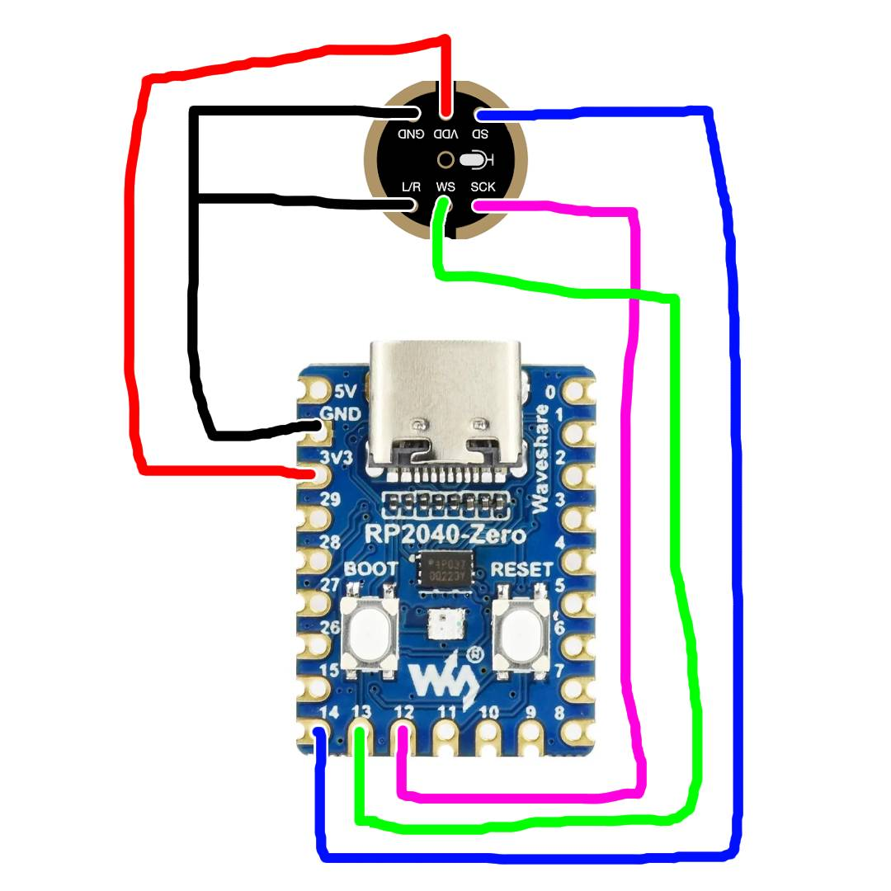
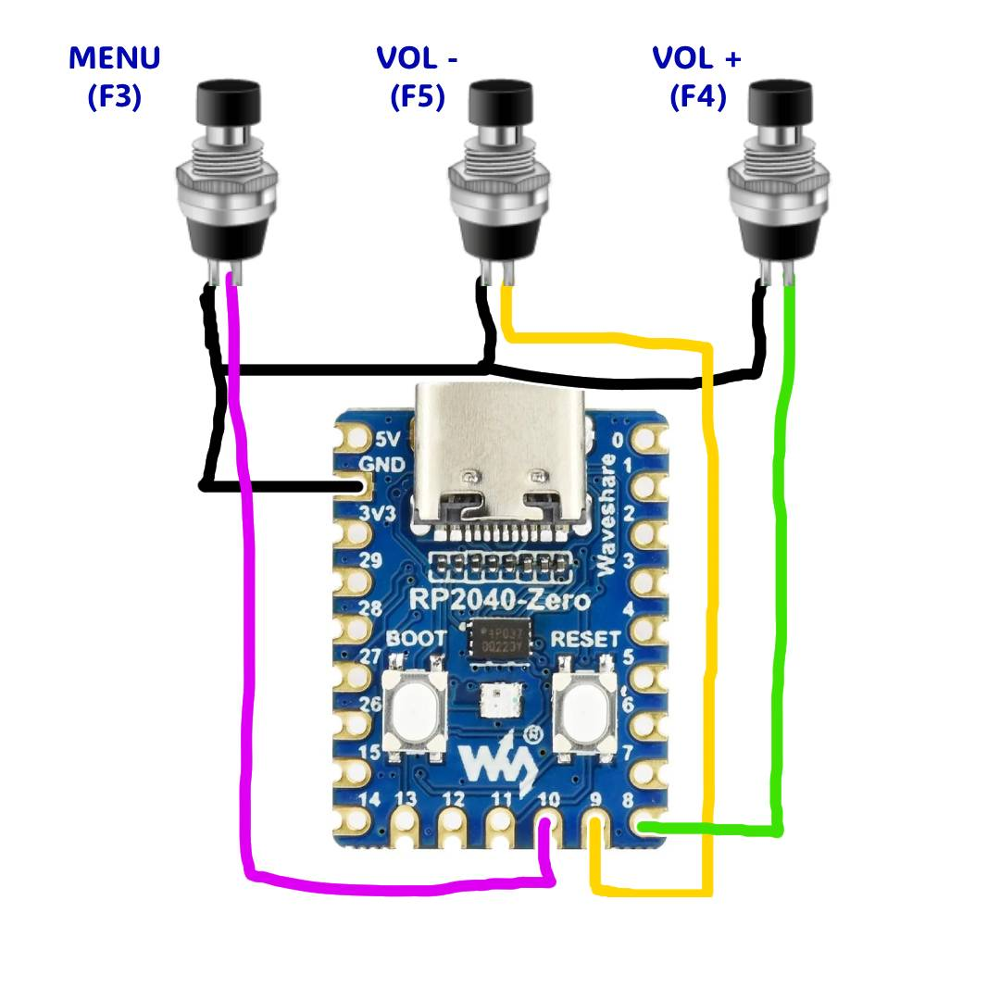

# BydPicoMic v1

An interoperability research firmware implementing a BYD MiniKaraoke/PA10 compatible USB microphone using Waveshare RP2040-Zero and INMP441. It presents itself to the vehicle as a UAC1 microphone and PA10 control interface, delivering real-time INMP441 audio via 48 kHz stereo USB capture.

The baseline firmware release point is tag `v1` (`806cfcf`) on the `main` branch.

<details>
<summary><b>한국어 (Korean)</b></summary>

Waveshare RP2040-Zero와 INMP441으로 BYD MiniKaraoke/PA10 호환 USB 마이크를 구현한 상호운용 연구 펌웨어다. 차량에는 UAC1 마이크와 PA10 제어 인터페이스로 보이며, INMP441의 실시간 음성을 48 kHz stereo USB capture로 전달한다.

최종 펌웨어 기준점은 `main` 브랜치의 태그 `v1` (`806cfcf`)이다.

</details>

## Demo Video

[](https://youtube.com/shorts/v1zlgp6622s)

*(Click image to play YouTube demo video)*

## Features Verified in v1

- USB Audio/HID composite device recognition on Windows and vehicle
- UAC1 48 kHz, signed 16-bit, stereo capture
- INMP441 48 kHz I2S real-time input
- PA10 connection, receiver/microphone info, and effect MD5 handshake
- Reflects vehicle volume/reverb and Recording Studio, KTV, Music Hall, Original modes
- WS2812 effect mode display
- 100 Hz low cut (HPF), 10 kHz high cut (LPF), +3 dB preamp and limiter
- F3/F4/F5 HID keyboard path verified on vehicle
- Physical volume+/volume-/menu controls on GP8/GP9/GP10

Tag `v1` does not include GPIO inputs; the current `main` branch connects physical button inputs with 25 ms debounce to the verified Interface 4 keyboard endpoint.

For final layout and known characteristics, see [V1_FINAL.md](docs/V1_FINAL.md). For protocol details, see [BPA10_USB_PROTOCOL.md](docs/BPA10_USB_PROTOCOL.md).

<details>
<summary><b>한국어 (Korean)</b></summary>

### v1에서 확인한 기능

- Windows와 차량에서 USB Audio/HID 복합 장치 인식
- UAC1 48 kHz, signed 16-bit, stereo capture
- INMP441 48 kHz I2S 실시간 입력
- PA10 연결, 수신기/마이크 정보 및 effect MD5 핸드셰이크
- 차량 volume/reverb와 Recording Studio, KTV, Music Hall, Original 모드 반영
- WS2812 effect mode 표시
- 100 Hz 저역 감쇠, 10 kHz 고역 제한, +3 dB 프리앰프와 리미터
- F3/F4/F5 HID keyboard 통로 실차 검증
- GP8/GP9/GP10 물리 버튼으로 차량 volume+/volume-/menu 입력

태그 `v1`에는 GPIO 입력이 없으며, 현재 `main`은 검증된 Interface 4 keyboard endpoint에 물리 버튼 입력과 25 ms debounce를 연결한다.

최종 구성과 알려진 특성은 [V1_FINAL.md](docs/V1_FINAL.md), 프로토콜 상세는 [BPA10_USB_PROTOCOL.md](docs/BPA10_USB_PROTOCOL.md)를 참고한다.

</details>

## Hardware

- Waveshare RP2040-Zero
- INMP441 I2S MEMS microphone
- Raspberry Pi Pico SDK 1.5.1

### INMP441 Wiring



| INMP441 | RP2040-Zero | Description |
|---|---|---|
| VDD | 3V3 | 3.3 V Power only |
| GND | GND | Common Ground |
| SCK | GP12 | I2S BCLK |
| WS | GP13 | I2S LRCLK |
| SD | GP14 | I2S Data |
| L/R | GND | Select left channel |

Do not connect 5 V to INMP441 VDD. GP12~GP14 are fixed in firmware.

### Button Wiring



| Function | RP2040-Zero | Switch Other Side | USB Input |
|---|---|---|---|
| Volume + | GP8 | GND | F4 |
| Volume - | GP9 | GND | F5 |
| Menu | GP10 | GND | F3 |

Connect each switch between its designated GPIO and GND. The firmware uses internal pull-ups, so no external resistor is needed. Switches are active-low (pulled LOW when pressed).

<details>
<summary><b>한국어 (Korean)</b></summary>

### INMP441 배선

| INMP441 | RP2040-Zero | 설명 |
|---|---|---|
| VDD | 3V3 | 3.3 V 전원 |
| GND | GND | 공통 접지 |
| SCK | GP12 | I2S BCLK |
| WS | GP13 | I2S LRCLK |
| SD | GP14 | I2S data |
| L/R | GND | left channel 선택 |

5 V를 INMP441 VDD에 연결하지 않는다. GP12~GP14는 펌웨어에 고정돼 있다.

### 버튼 배선

| 기능 | RP2040-Zero | 스위치 반대쪽 | USB 입력 |
|---|---|---|---|
| 볼륨 + | GP8 | GND | F4 |
| 볼륨 - | GP9 | GND | F5 |
| 메뉴 | GP10 | GND | F3 |

각 스위치는 해당 GPIO와 GND 사이에 연결한다. 펌웨어가 내부 pull-up을 사용하므로 외부 저항은 필요하지 않으며, 눌렀을 때 LOW가 되는 active-low 입력이다.

</details>

## Build

On Windows, use the script included in the repository:

```powershell
powershell -ExecutionPolicy Bypass -File tools/build.ps1
```

The script defaults to using `waveshare_rp2040_zero` and standard Windows Pico SDK 1.5.1 installation paths. If using another SDK, set `PICO_SDK_PATH` first.

You can also configure manually:

```powershell
cmake -S . -B build -DPICO_BOARD=waveshare_rp2040_zero -DCMAKE_BUILD_TYPE=Release
cmake --build build --parallel
```

Output file:

```text
build/pa10_rp2040_mic.uf2
```

TinyUSB vendors a verified UAC1 modification in `third_party/tinyusb-uac1`. No separate git submodule is required.

<details>
<summary><b>한국어 (Korean)</b></summary>

Windows에서는 저장소에 포함된 스크립트를 사용한다.

```powershell
powershell -ExecutionPolicy Bypass -File tools/build.ps1
```

스크립트는 기본적으로 `waveshare_rp2040_zero`와 표준 Windows Pico SDK 1.5.1 설치 경로를 사용한다. 다른 SDK라면 먼저 `PICO_SDK_PATH`를 설정한다.

직접 구성할 수도 있다.

```powershell
cmake -S . -B build -DPICO_BOARD=waveshare_rp2040_zero -DCMAKE_BUILD_TYPE=Release
cmake --build build --parallel
```

출력 파일: `build/pa10_rp2040_mic.uf2`

TinyUSB는 동작이 확인된 UAC1 수정본을 `third_party/tinyusb-uac1`에 vendoring했다. 별도 submodule은 필요하지 않다.

</details>

## Upload & Verification

1. Connect RP2040-Zero while pressing the BOOTSEL button.
2. Copy `build/pa10_rp2040_mic.uf2` to the `RPI-RP2` drive.
3. On Windows, verify recognition as `BYD-micTS02`, 2-channel 48 kHz input.
4. On the vehicle, verify in order: microphone connection, audio output, volume/reverb/mode adjustment.

Windows may cache previous descriptors; v1 serial uses `P3U1ST04`.

<details>
<summary><b>한국어 (Korean)</b></summary>

1. BOOTSEL을 누른 상태로 RP2040-Zero를 연결한다.
2. `build/pa10_rp2040_mic.uf2`를 `RPI-RP2` 드라이브에 복사한다.
3. Windows에서는 `BYD-micTS02`, 2채널 48 kHz 입력으로 확인한다.
4. 차량에서는 마이크 연결, 음성 출력, volume/reverb/mode 순서로 확인한다.

Windows가 이전 descriptor를 캐시할 수 있어 v1 serial은 `P3U1ST04`를 사용한다.

</details>

## Current Audio Pipeline

```text
INMP441
  → PIO I2S 48 kHz / DMA
  → mono 16-bit conversion
  → 100 Hz HPF / 10 kHz LPF
  → vehicle volume · reverb · mode DSP
  → +3 dB preamp / limiter
  → duplicate mono to stereo
  → UAC1 EP 0x81
  → Vehicle
```

The `tools/generate_test_wav.ps1` script is a legacy audio asset generator from past WAV playback testing. It is not included in the current CMake target and is not used as a firmware audio source.

<details>
<summary><b>한국어 (Korean)</b></summary>

`tools/generate_test_wav.ps1` 스크립트는 과거 WAV 재생 시험용 음원 생성 도구다. 현재 CMake target에는 포함되지 않으며 펌웨어 음원으로 사용되지 않는다.

</details>

## Known Characteristics

- At high reverb settings, metallic ringing may occur due to fixed delay line characteristics. `Original` mode and reverb 0 bypass the effect path.
- Windows UAC Feature Unit volume requests are saved for compatibility responses, but actual PCM gain follows vehicle PA10 volume control.
- Compatibility was verified on a specific BYD head unit and MiniKaraoke app combination used during development.
- Pico W web/network microphone ideas were explored only on a separate branch and are not in v1.

<details>
<summary><b>한국어 (Korean)</b></summary>

- 리버브가 큰 설정에서는 고정 지연선 특성상 금속성 ringing이 들릴 수 있다. `Original`과 reverb 0에서는 effect path를 우회한다.
- Windows UAC Feature Unit의 volume 요청값은 호환 응답용으로 보관하지만 실제 PCM gain은 차량 PA10 volume 제어를 따른다.
- 호환성은 개발에 사용한 특정 BYD head unit과 MiniKaraoke 조합에서 확인했다.
- Pico W 웹/네트워크 마이크 구상은 별도 브랜치에서 검토만 했고 v1에는 없다.

</details>

## Repository Structure

```text
docs/                       Final configuration & protocol specification
src/                        Firmware, USB descriptors, I2S PIO
third_party/tinyusb-uac1/   Fixed TinyUSB UAC1 vendor copy
tools/                      Build and legacy test asset generator tools
```

<details>
<summary><b>한국어 (Korean)</b></summary>

```text
docs/                       최종 구성 및 프로토콜 명세
src/                        펌웨어, USB descriptor, I2S PIO
third_party/tinyusb-uac1/   고정된 TinyUSB UAC1 수정본
tools/                      빌드 및 과거 시험 asset 생성 도구
```

</details>

## Legal and Compatibility Notice

This project is an independent interoperability research project and is not an official product of BYD or PA10.
The test VID/PID and identity strings are not assigned to this project and must not be used in commercial products. For commercial products, obtain official VID/PID and necessary licenses.

Project code is under the MIT License, and dependency information is detailed in [THIRD_PARTY_NOTICES.md](THIRD_PARTY_NOTICES.md).

<details>
<summary><b>한국어 (Korean)</b></summary>

이 프로젝트는 BYD 또는 PA10의 공식 제품이 아닌 독립적인 상호운용 연구다. 시험용 VID/PID와 identity 문자열은 이 프로젝트에 할당된 값이 아니므로 상용 제품에 그대로 사용하면 안 된다. 제품화 시 정식 VID/PID와 필요한 허가를 확보해야 한다.

프로젝트 코드는 MIT License이며 의존성 정보는 [THIRD_PARTY_NOTICES.md](THIRD_PARTY_NOTICES.md)에 정리돼 있다.

</details>
